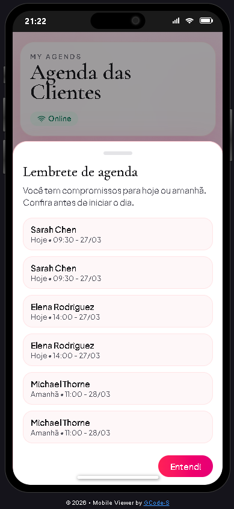
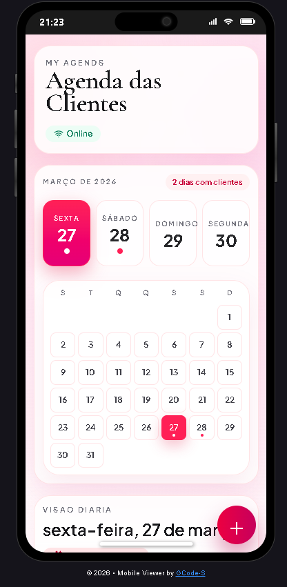
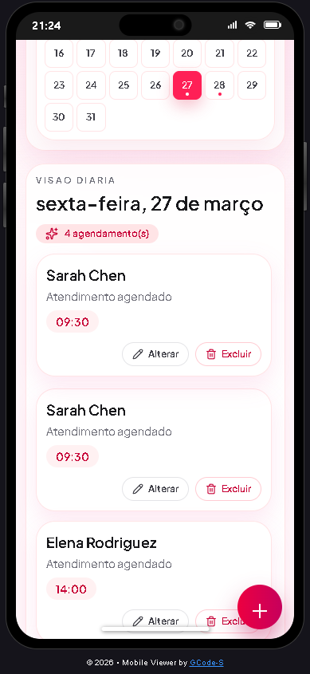

# Agends - Agenda de Clientes (Web App)

Sistema web de agendamento com foco em usabilidade mobile, persistencia local e funcionamento offline.

## Visao Geral

O Agends e uma aplicacao de agenda para controle de clientes e horarios.
Foi desenvolvido em tela unica, com interface moderna, fluxo rapido de cadastro e comportamento responsivo para celular e desktop.

## Principais Funcionalidades

- Criacao de agendamentos com nome, data e hora
- Edicao de agendamentos existentes
- Exclusao individual de agendamento
- Limpeza total do armazenamento com confirmacao
- Calendario interativo com marcacao de dias com eventos
- Exibicao diaria dos compromissos selecionados
- Lembretes automaticos para hoje e amanha
- Persistencia local com Dexie (IndexedDB)
- Estado global com Zustand
- Funcionamento offline via Service Worker + Manifest (PWA)

## Stack Tecnologica

- React 19
- TypeScript
- Vite
- Tailwind CSS
- Motion
- Dexie
- Zustand
- date-fns
- lucide-react

## Estrutura (resumo)

- `src/App.tsx`: tela principal e orquestracao dos modais
- `src/store/useAgendaStore.ts`: regras de negocio e operacoes CRUD
- `src/lib/db.ts`: configuracao do banco local (Dexie)
- `src/components/`: componentes de UI (cards, modais, calendarios)
- `public/sw.js`: service worker offline
- `public/manifest.webmanifest`: configuracao PWA

## Como Executar

### 1. Instalar dependencias

```bash
npm install
```

### 2. Rodar em desenvolvimento

```bash
npm run dev
```

### 3. Build de producao

```bash
npm run build
```

### 4. Preview da build

```bash
npm run preview
```

## Scripts Disponiveis

- `npm run dev`: inicia ambiente de desenvolvimento
- `npm run build`: gera build de producao
- `npm run preview`: serve localmente a build
- `npm run lint`: analise de padrao de codigo

## Offline e Instalacao como App

O projeto esta preparado para ser instalado na tela inicial (iPhone/Android) e abrir sem internet apos o primeiro carregamento online.

### Recomendacoes para iPhone (Safari)

1. Publicar em HTTPS
2. Abrir o site no Safari com internet
3. Adicionar a tela inicial
4. Abrir ao menos uma vez o app instalado com internet
5. Depois disso, o app pode ser aberto offline

Observacao: o iOS pode limpar cache local em cenarios especificos (ex.: pouco espaco), comportamento nativo da plataforma.

## Capturas de Tela

### Tela 1



### Tela 2



### Tela 3



## Licenca

Este projeto é open source sob a Licença MIT.
